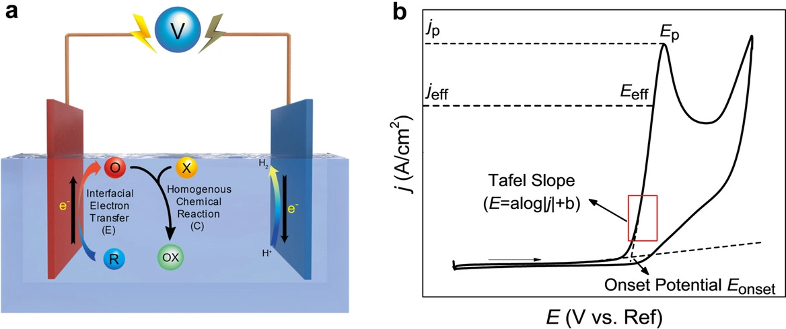

# Repeat Experiment

Based on the paper:
>Chen, Yuxuan, et al. "Electro‐Descriptors for the Performance Prediction of Electro‐Organic Synthesis." Angewandte Chemie 133.8 (2021): 4245-4253.

It seems to provide a view to combine the ML to chemistry, at leat let the ordinary chemists trust ML.

So the first thing we need to do, it is to repeat the experiment here.

## Noun explanation
- onset potential and Tafel slope

Could be found in the figure:
  
For a positive scan from (-1 V, 3 V), choose the region after onset point (with the overpotential of 0.3-0.5 V) in CV diagram
and convert the graph into E-log(|i|) relationship. Find out the linear region in the E-log(|i|) diagram and fit the curve to get
Tafel slope

- Determination of effective current and effective voltage. 

  >Determination of effective current and effective voltage. The model reaction in the reference (Entry 1-1) was used for the determination of effective current. 
  By measuring the voltage between working electrode and counter electrode, it can be acquired that the experimental voltage (6.6 V) approximately corresponds 
  to 1.5 V-1.75 V (vs. Ag/AgCl) in the three-electrode system in CV test. Then effective current is defined as the average current in the CV of Entry 1-1 when 
  the corresponding voltage is 1.5 V-1.75 V (vs. Ag/AgCl). For convenience, the closest integral number is chosen as the effective current (100 μA/cm2 ). Effe
  ctive voltage for other substrates and reaction conditions can be acquired when their CV current reaches the effective current.

(I would say it is very har to understand,the following may be wrong)

Two possible way to caculate the 1.5 V-1.75 V: (Not correct)

(need to be discussed!!!!)

